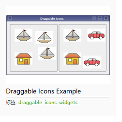

[TOC]

### 效果图

***

### 主要功能点

1. 节点自由拖拽移动

2. 自绘树的指示器

3. 可拖拽添加节点

***

### 概要

- 整体还是对于model-view这一套的使用，左侧的实现可看我的这篇[文章](https://blog.csdn.net/weixin_49065061/article/details/138339626?spm=1001.2014.3001.5501)，本文具体讲讲这个树`QTreeView`的拖拽与自绘指示器。
- 关于树节点的增删改查，我就不解释了，文末我也会贴出源码仓库，自己去看。若觉得项目复杂，可以直接看QT的demo，

- 若是你想了解拖拽，我推荐你看QT的这个demo，方便你快速搞定。


***

### 遇到的问题

1. 当外部数据拖入到树上时，鼠标样式为禁止状态，不可放下。

- `setAcceptDrops(true);`设置支持放置

2. 当外部数据拖入到树上时，没有触发指示器

- 这个问题其实很麻烦，查了很多资料才知道，树的指示器要是树中模型已存好的数据才会触发，像这种外部拖进来的不会有，这种时候只能通过自绘实现，下面会详细说明，也是本文的重点。

3. 如何判断树指示器的位置的

- 这个是树中只带的类`DropIndicatorPosition`决定的，你无法改变

***

### 指示器

- QTreeView里只需要使用`setStyle`函数设置继承于，`QProxyStyle`的类就行，`QProxyStyle`中需要重写`drawPrimitive`函数。

函数代码如下

```cpp
void ControlViewStyle::drawPrimitive(PrimitiveElement element, const QStyleOption *option, QPainter *painter, const QWidget *widget) const
{
    if (element == QStyle::PE_IndicatorItemViewItemDrop && !option->rect.isNull())
    {
        QRect rect = option->rect;
        QPen pen;
        pen.setColor(QColor(qRgb(135, 206, 235)));
        pen.setWidth(2);
        painter->setPen(pen);
        painter->setRenderHint(QPainter::Antialiasing);
        if (option->rect.height() == 0)
        {
            painter->drawEllipse(QPoint(10, option->rect.top()), 4, 4);
            painter->drawLine(QPoint(10, rect.top()), QPoint(widget->width() - 10, rect.top()));
        }
        else
        {
            rect.setLeft(5);
            rect.setRight(widget->width() - 5);
            painter->drawRect(rect);
        }

        return;
    }
    QProxyStyle::drawPrimitive(element, option, painter, widget);
}
```

- 设置完成后，处于树内的节点任意拖拽是会出现自绘的指示器了。但是从树外拖入的数据，指示器并不会出现。这个时候就需要通过树中`paintEvent`实现自绘了。在拖拽move时可以通过`DropIndicatorPosition`得到当前所在位置，以及`dragMoveEvent`处理得到的数据是树内还是树外(防止多次绘制)，不断的`update`，从而达到自绘效果。
函数如下

```cpp
void ControlDialogTreeView::paintEvent(QPaintEvent *event)
{
    QTreeView::paintEvent(event);

    if (m_hoveredIndex.isValid() && !m_isMyselfDrop)
    {
        QPainter painter(viewport());
        QRect rect = visualRect(m_hoveredIndex);
        QRect rowRect = getRowVisualRect(m_hoveredIndex);
        QPen pen;
        pen.setColor(QColor(qRgb(135, 206, 235)));
        pen.setWidth(2);
        painter.setPen(pen);
        painter.setRenderHint(QPainter::Antialiasing);

        DropIndicatorPosition dropindicationPos = dropIndicatorPosition();
        switch (dropindicationPos)
        {
        case QAbstractItemView::AboveItem:
        {
            painter.drawEllipse(QPoint(10, rowRect.top()), 4, 4);
            painter.drawLine(QPoint(10, rect.top()), QPoint(rowRect.width() + 10, rect.top()));
        }
        break;
        case QAbstractItemView::BelowItem:
        {
            painter.drawEllipse(QPoint(10, rowRect.top()), 4, 4);
            painter.drawLine(QPoint(10, rect.top()), QPoint(rowRect.width() + 10, rect.top()));
        }
        break;
        case QAbstractItemView::OnItem:
        {
            rect.setLeft(5);
            rect.setRight(rowRect.width() + 5);
            painter.drawRect(rect);
        }
        break;
        case QAbstractItemView::OnViewport:
            qDebug() << "*****OnViewport";
            break;
        }
    }
}
```

- 移动

```cpp
void ControlDialogTreeView::dragMoveEvent(QDragMoveEvent *event)
{
    QTreeView::dragMoveEvent(event);
    auto data = event->mimeData();
    if (!data->hasFormat(GlobalDefinition::controlDialogMimeType))
    {
        m_isMyselfDrop = false;
    }
    QModelIndex index = indexAt(event->pos());
    if (index.isValid())
    {
        m_hoveredIndex = index;
        update();
    }
    else
    {
        m_hoveredIndex = QModelIndex();
    }
    event->accept();
}

```

***

### 拖拽

- 拖拽的话还是推荐看QT的demo，那些示例很明了。

- 简单说一下，你的拖拽若是使用了`Model-view`这套设计思想，那么数据的关键就在Model中的`mimeData`函数中，`mimeTypes`函数设置支持那些数据的放置，`supportedDropActions`支持那些操作类型，以及view中各种事件的处理。简单点的，像上面我推荐的demo，不使用`Model-view`。直接在`mousePressEvent`就可以实现，关键在于你的把你的数据存到`QMimeData`，然后在drop的时候能解析出来。拖拽的代码太多了，我就不贴出来了，感兴趣的可以自己把仓库拉下来。

***

### 总结

- 知识理应共享，[源码在此](https://gitee.com/shan-jie6/my-case/tree/master/QT/QtDesigner)

- 写这个案例遇到的问题其实很多，当然也让自己学到了挺多，对拖拽这套理解更深了点
