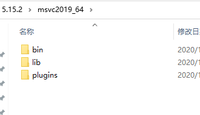
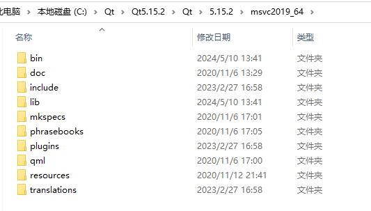

### 遇到的问题

- **当我们在VsCode使用CMake来调试QT程序时，想`F11`进入到QT源码时，发现进不去，无法查看源码**。

****

### 原因

- 这种情况一般都是安装目录下没有==pdb==文件导致的。
- PDB文件：是一个包含调试信息的数据库，它由编译器和链接器在构建程序时生成。PDB文件记录了程序的调试信息，如变量类型、函数原型、源代码行号等，这些信息对于调试和性能分析非常重要。
  
  ***

### 解决

- 以我为例，使用的是`msvc2019_64`的版本，我的QT安装目录下没有PDB文件，那么我就要去官网下载==相同版本==的PDB。
- [PDB下载](https://download.qt.io/online/qtsdkrepository/windows_x86/desktop/qt5_5152/qt.qt5.5152.debug_info.win64_msvc2019_64/)，下载==qtBase==那个就行了。
- 下载解压完后，为以下文件

- 将其放到安装的目录下，如

- 再贴一个QT官网源码的[下载路径](<https://download.qt.io/archive/qt/5.15/5.15.2/single/>)
- **放置完后，还需要设置vscode的`settings.json`文件，具体设置请看我之前写的这篇[文章](https://blog.csdn.net/weixin_49065061/article/details/135822504?spm=1001.2014.3001.5502)**